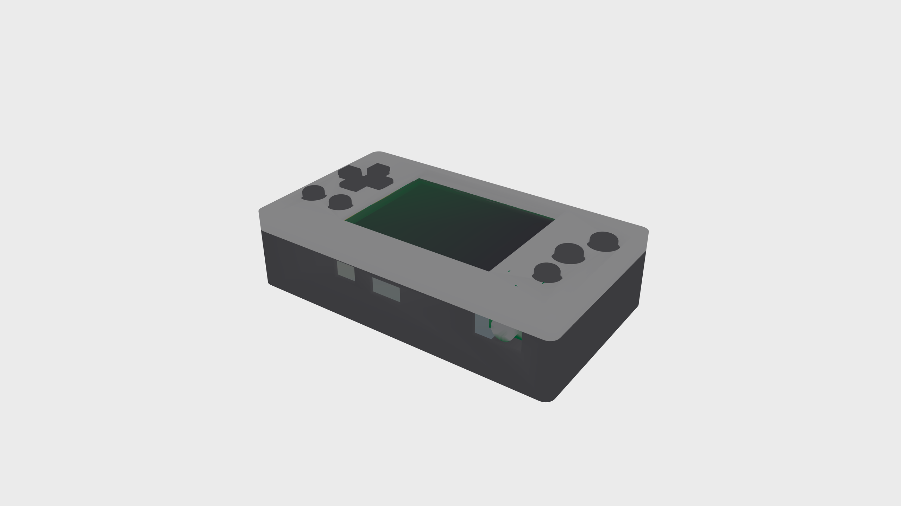
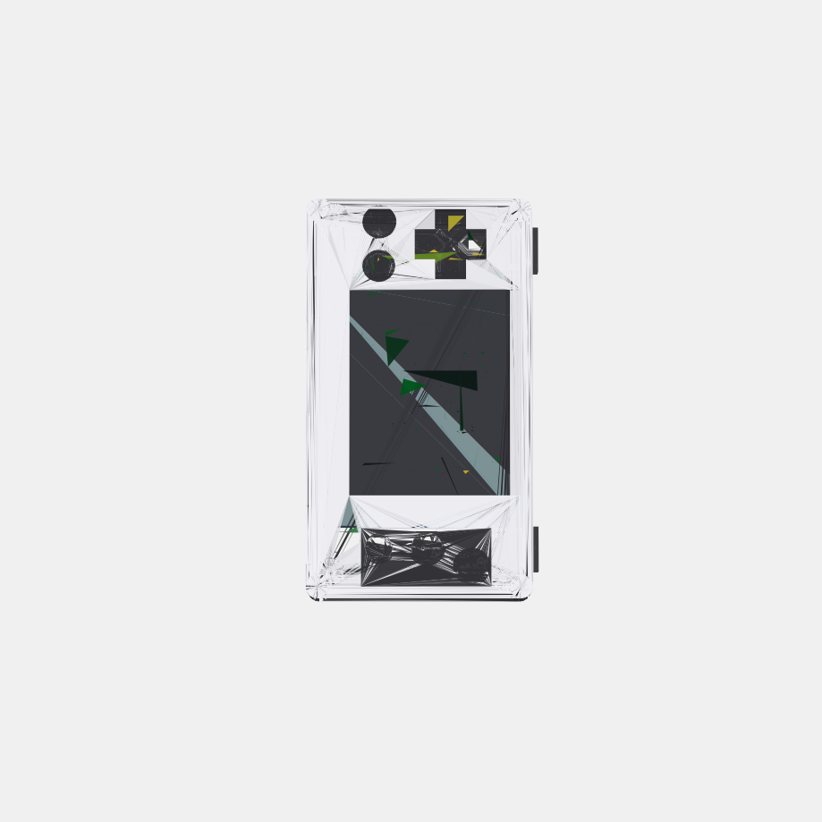
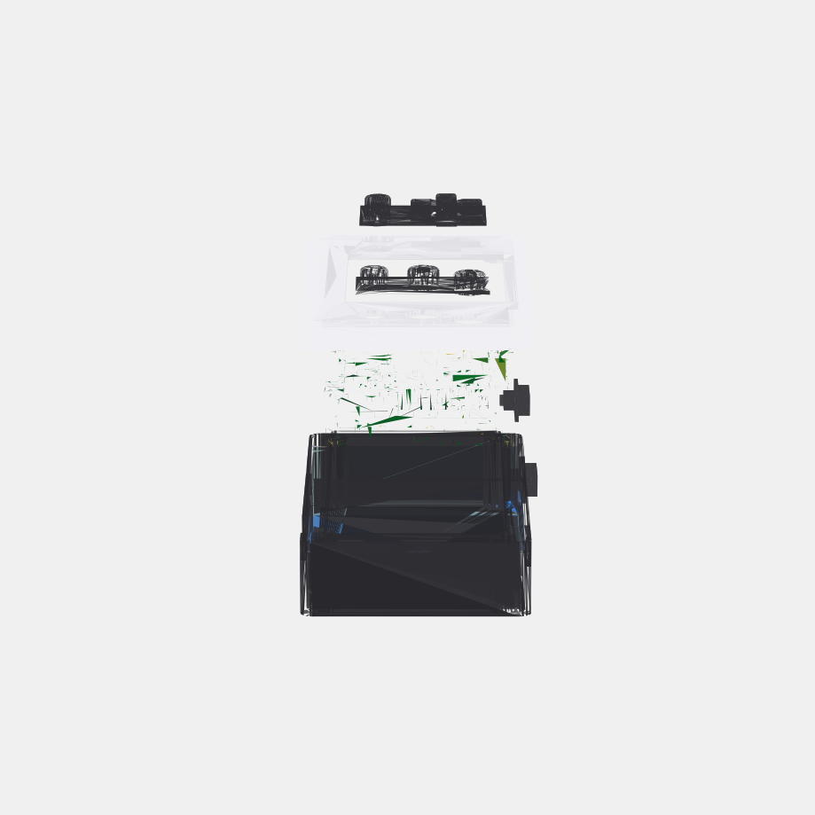
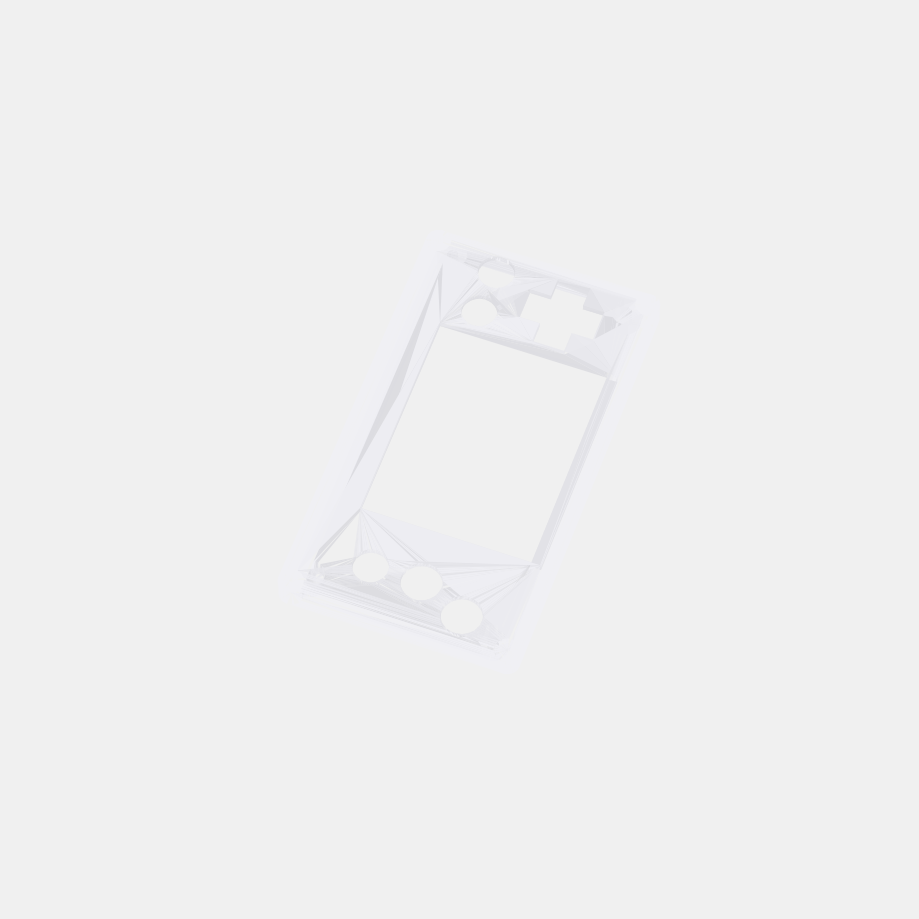

# ESP32-EMU - DIY Retro Gaming Console

> **[View Interactive 3D Models](https://pjcau.github.io/esp32-emu/)**

Personal project for building a retro gaming emulation console based on ESP32 WROVER, using the ESPlay Retro Emulation firmware.

## Overview

This project documents the build of a handheld console for emulating classic retro gaming systems, based on the ESPlay Micro hardware and the open source firmware by [pebri86](https://github.com/pebri86/esplay-retro-emulation).

## Supported Emulators

- **Nofrendo** - NES/Nintendo Emulator
- **GNUBoy** - GameBoy and GameBoy Color
- **SMSPlusGX** - Sega Master System, Game Gear and Coleco Vision
- **Atari** - Atari Systems
- **PC Engine** - NEC PC Engine/TurboGrafx
- **ZX-Spectrum** - Sinclair ZX Spectrum
- **MSX** - MSX Standard

> Note: Due to the 4MB Flash ROM, only 3 emulators can be preloaded at the same time.

## Additional Features

- In-game menu for all emulators
- Built-in audio player (WAV, MP3, OGG, FLAC)
- ESPlay Launcher with UGUI interface
- Built-in WiFi and Bluetooth 4 BLE

## Technical Specifications (ESPlay Micro)

| Component      | Specification               |
| -------------- | --------------------------- |
| Processor      | ESP32 WROVER dual-core      |
| Flash          | 4MB built-in                |
| PSRAM          | 4MB built-in                |
| Display        | 2.4" ILI9341 TFT Panel      |
| Audio DAC      | UDA1334A I2S                |
| Audio Jack     | 3.5mm                       |
| Storage        | microSD slot (SDMMC 1-line) |
| Charger        | TP4056 Li-Po built-in       |
| USB-Serial     | CH340C                      |
| PCB Dimensions | 100 x 50 mm                 |
| Expansion Port | I2C                         |

## Bill of Materials

### 1. Main Board - ESPlay Micro
- **Product**: ESPlay Micro - DIY Console ESP32 WROVER
- **Price**: ~27 EUR
- **Link**: [AliExpress](https://it.aliexpress.com/item/1005010451380752.html)
- Includes: 1x ESPlay Micro, 1x USB Cable, 1x SD Card

### 2. LiPo Battery
- **Product**: 3.7V 5000mAh Lithium Polymer Battery (955565)
- **Price**: ~8 EUR
- **Link**: [AliExpress](https://it.aliexpress.com/item/1005008867815394.html)

### 3. MicroSD Card (optional, for additional ROMs)
- **Product**: SanDisk Ultra Micro SD (32GB/64GB/128GB)
- **Price**: ~1 EUR (32GB)
- **Link**: [AliExpress](https://it.aliexpress.com/item/1005007498167692.html)

### Total Hardware Cost: 35 EUR

## 3D Printed Case

Starting from the original "ESPlay Micro V2 Case" model by PierreGG, I developed a **custom V7 case** generated parametrically via Python + trimesh scripts, optimized for 3D printing.

- **Original model**: [Thingiverse - ESPlay Micro V2 Case](https://www.thingiverse.com/thing:5592683)
- **Custom V7 case**: `model_3d_cover_v1/scripts/build_v7.py` (automatic generation via Docker)
- **Output**: `model_3d_cover_v1/output/v7/` (STL for printing + GLB for viewing)

### V7 Case - Features

| Feature | Detail |
| --- | --- |
| Top shell | Solid top plate with precise cutouts for screen, D-pad (cross), buttons (round) |
| Bottom shell | Optimized depth (19.3mm), battery against inner wall |
| Screws | Countersunk M3 in the bottom, flush with the surface |
| Buttons | 1mm retention flange for snap-fit between board and top body |
| Ports | USB-C, audio jack, SD card slot, shoulder L/R |
| External dimensions | 103.3 x 58.3 x 27.3 mm |

### Closed Assembly





### Exploded Assembly




### Top Body - Cutout Detail



### How to Generate the Case

```bash
cd model_3d_cover_v1
docker compose run --rm cover-tool /workspace/scripts/build_v7.py
```

STL files for printing are generated in `output/v7/`:
- `top_body_v7.stl` - Top shell
- `bottom_body_v7.stl` - Bottom shell
- `btn_assy_1_v7.stl` - Left button assembly (D-pad + Start/Select)
- `btn_assy_2_v7.stl` - Right button assembly (A/B/X)
- `shoulder_l.stl` / `shoulder_r.stl` - Shoulder buttons

### 3D Printing

I used an **online 3D printing service** for manufacturing the case.

- **Printing cost**: 30 EUR
- Includes all necessary parts for the case

### Required Materials for the Case
- 4x M3 15mm screws
- Screen protector (optional): laser-cut 3mm acrylic (SVG file included)

## Cost Summary

| Item                              | Cost       |
| --------------------------------- | ---------- |
| Hardware (ESPlay + Battery + SD)  | 35 EUR     |
| 3D Printed Case                   | 30 EUR     |
| **Total Project Cost**            | **65 EUR** |

## Resources and Useful Links

| Resource               | Link                                                                                         |
| ---------------------- | -------------------------------------------------------------------------------------------- |
| ESPlay Firmware        | [GitHub - pebri86/esplay-retro-emulation](https://github.com/pebri86/esplay-retro-emulation) |
| Official Documentation | [Makerfabs - ESPlay Micro](https://www.makerfabs.com/esplay-micro.html)                      |
| 3D Case                | [Thingiverse - ESPlay Micro V2 Case](https://www.thingiverse.com/thing:5592683)              |

## Firmware Build Instructions

### Requirements
- ESP-IDF v3.3
- FFmpeg installed and in PATH

### Procedure
1. Clone the repository: `git clone https://github.com/pebri86/esplay-retro-emulation.git`
2. Edit `mkrelease.sh` with the correct paths
3. Run `./mkrelease.sh` to generate `esplay-retro-emu.fw`
4. Copy the file to `esplay/firmware/` on the SD card
5. Boot the console while holding the B button (bootloader mode)
6. Flash the firmware from the menu

## Assembly Instructions

1. Solder the LiPo battery to the ESPlay Micro board connectors
2. Insert the microSD card with the ROMs
3. 3D print the case
4. Assemble everything with the M3 screws
5. (Optional) Apply the acrylic screen protector

## SD Card Directory Structure

```
/
├── esplay/
│   └── firmware/
│       └── esplay-retro-emu.fw
├── roms/
│   ├── nes/
│   ├── gb/
│   ├── gbc/
│   ├── sms/
│   └── gg/
└── music/
    └── (WAV, MP3, OGG, FLAC files)
```

## Legal Notes

- The ESPlay firmware is released under the MIT License
- Only use ROMs for games you legally own
- The 3D case is released under the Creative Commons BY 4.0 License

## TODO

- [x] Order components
- [x] 3D print the case
- [ ] Assemble the hardware
- [ ] Flash the firmware
- [ ] Test the emulators
- [ ] Document the process with photos

---

*Project based on the work of [Fuji Pebri](https://github.com/pebri86) and the ESPlay community.*
